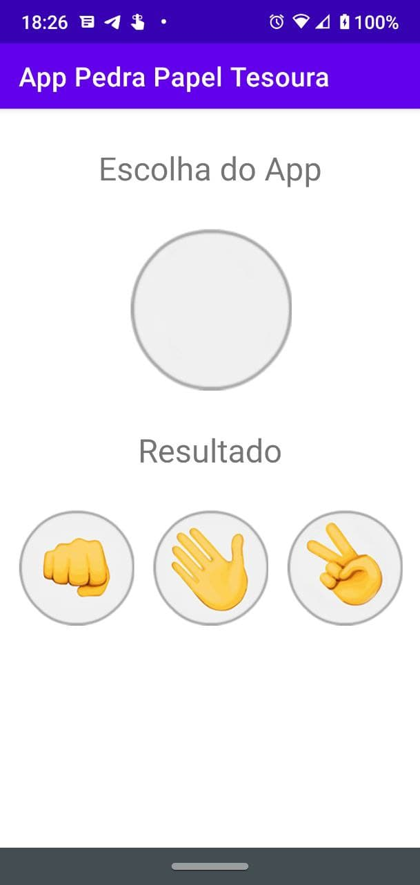
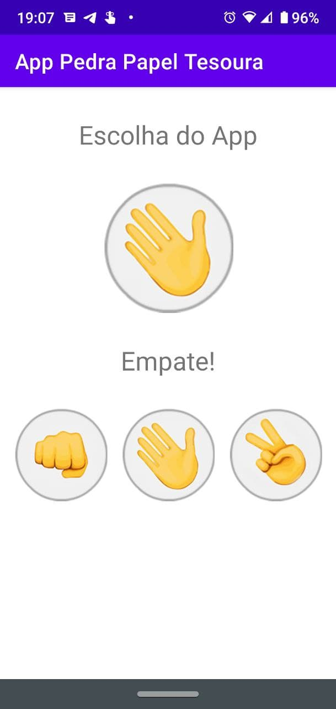
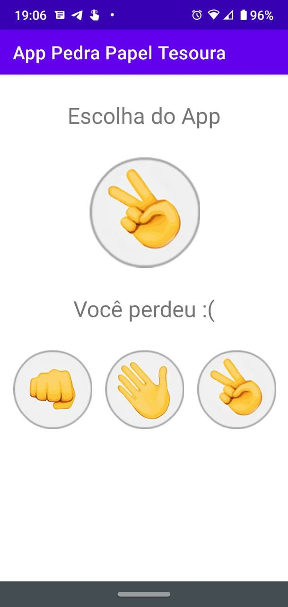
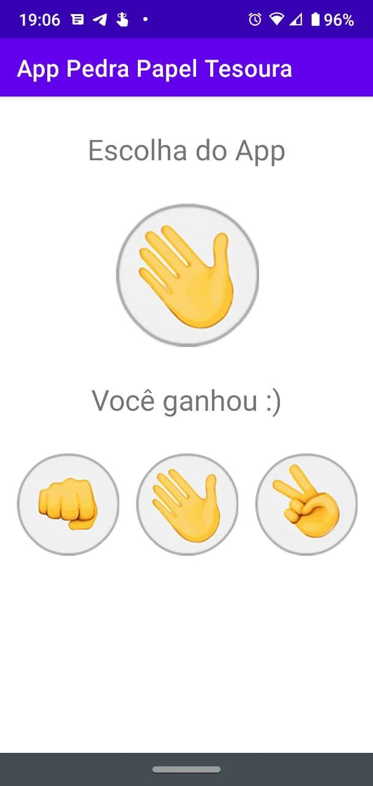

# App Pedra-Papel-Tesoura

## Table of contents

- [Introduction](#introduction)
- [Screenshots](#screenshots)
- [Technical info](#technical-info)

  [Languages](#languages)

- [Credits](#credits)
- [Lincense](#license)

## Introduction

This app implements the millennial game Rock Paper Scissors. The origins and other information about the game can be found in the [World Rock Paper Scissors Association](https://www.wrpsa.com/).

[//]: # "this is a workaround to make a comments"
[//]: # "## Features"
[//]: # "## Demo"

## Screenshots

|                  Initial screen                   |             Draw screen              |
| :-----------------------------------------------: | :----------------------------------: |
|  |  |

|              Defeat screen               |               Victory screen               |
| :--------------------------------------: | :----------------------------------------: |
|  |  |

## Technical info

### Languages

 

## Credits

This app is one of the projects developed in the online course **Desenvolvimento Android Completo 2021 - Crie 18 Apps**, available at [Udemy](https://www.udemy.com/course/curso-de-desenvolvimento-android-oreo/).

## License

